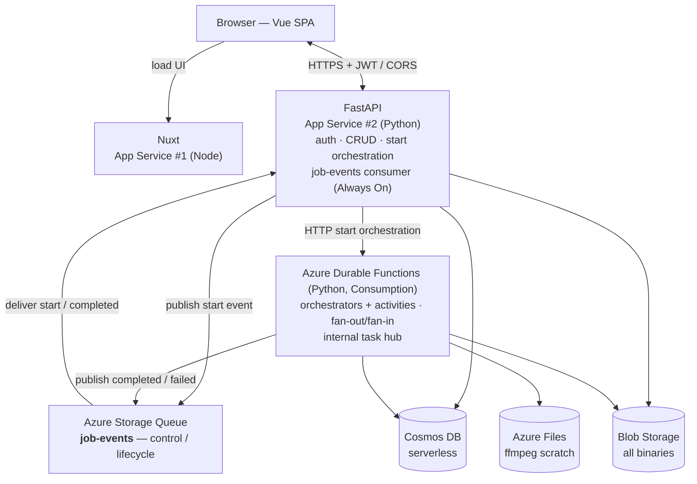
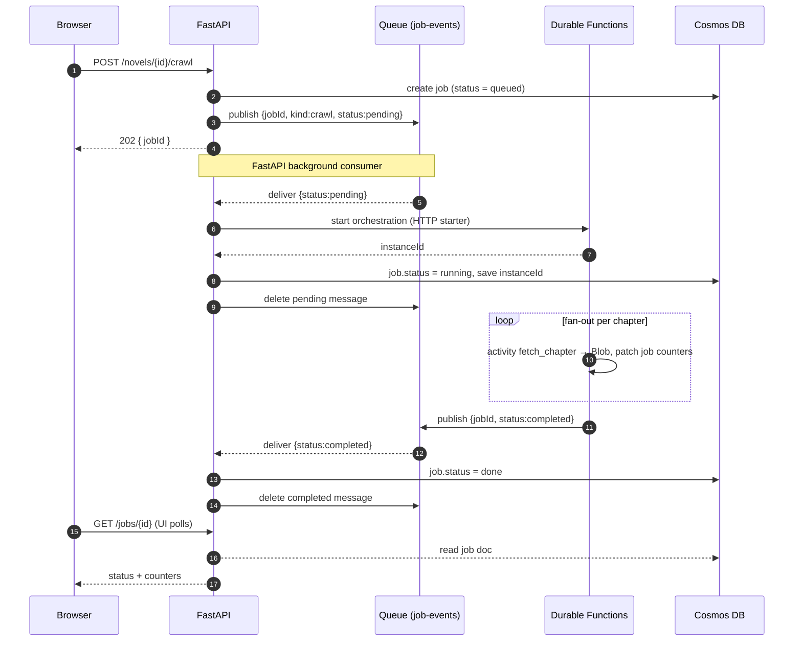

# Novel Media Studio — Architecture

An automated pipeline that turns web novels into translated text, narrated audio,
AI-generated illustrations, and assembled video. This document describes the system
design; see [`deployment.md`](./deployment.md) for infrastructure, CI/CD, and cost.

## Design decisions

1. **Provider posture: premium quality.** Default to the best providers (Claude/GPT for
   translation, ElevenLabs/Azure Neural HD for voice, gpt-image-1/Imagen for illustrations,
   Veo/Kling for video). Providers stay swappable per-project via the "AI Models" page, so
   cheaper tiers can be chosen without code changes.
2. **Web tier:** Nuxt and FastAPI each on an Azure App Service (one shared plan). The browser
   calls FastAPI **directly** (CORS + JWT) — no Nitro BFF.
3. **Background engine:** Azure **Durable Functions (Python)**, Consumption plan, scale-to-zero.
   It owns the per-chapter/per-scene **fan-out/fan-in**. No Worker App Service, no managed Redis.
4. **Job lifecycle via a control queue:** a single Azure Storage Queue (`job-events`) decouples
   the HTTP request from orchestration start and completion (see [Job lifecycle](#job-lifecycle)).
5. **Video: slideshow first.** Default output is a free ffmpeg "Ken Burns" slideshow
   (stills + audio); true per-scene AI video generation is a later, opt-in, metered feature.

## System diagram



- **Nuxt** serves the SPA/SSR UI. **FastAPI** is the domain API: auth, CRUD, starting
  orchestrations, and consuming `job-events`. It never does heavy work inline and never
  blocks a request on a long job.
- **Durable Functions** is the background engine: an **orchestrator** fans out one **activity**
  per chapter/scene and fans in the results; sub-orchestrations chain multi-stage pipelines
  (tts → assemble). Retries, checkpointing, and the control/work-item queues are handled by the
  runtime — the `job-events` queue above is a separate, app-level control channel.
- **Cosmos DB** holds all state (small docs). **Blob** holds all binaries (raw HTML, translated
  text, audio, images, video). **Azure Files** is ffmpeg scratch only.

## Repository layout (`srcs/`)

Building onto the existing scaffold (`srcs/app` Nuxt, `tests/` Playwright):

```
srcs/
  app/                # Nuxt (exists) — pages/components/layouts/middleware; calls FastAPI directly
  api/                # FastAPI (NEW): core/ domain/ routers/ services/ repositories/
                      #   + durable client + job-events consumer (background loop)
  workers/            # Azure Durable Functions app (NEW, Python):
                      #   host.json, function_app.py
                      #   orchestrators/  (crawl, translate, tts, image, assemble)
                      #   activities/     (fetch_chapter, translate_chapter, tts_segment, gen_image, ffmpeg_assemble, emit_completion)
                      #   providers/      (llm/ tts/ image/ video/ adapters)
  shared/             # (NEW) pydantic schemas, enums, container names,
                      #        connector + provider contracts
  infra/              # (NEW) Bicep + CI/CD — see deployment.md
```

`api/` and `workers/` both depend on `shared/` so document schemas, enums, connector
contracts, and provider adapters never drift.

## Job lifecycle

Long jobs are never awaited inside an HTTP request. A single control queue (`job-events`)
carries lifecycle messages `{ jobId, kind, status, instanceId? }`; FastAPI runs a background
consumer (works because the web app is Always On). Flow for a crawl job:



- **Start** is decoupled: the request just publishes a `pending` event and returns `202`.
  The consumer picks it up, starts the orchestration, records the `instanceId`, and moves the
  job to `running`. If the trigger fails, the message redelivers.
- **Completion** is a message: the orchestration's final `emit_completion` activity publishes a
  `completed` (or `failed`) event; the consumer marks the job `done`. (A webhook to FastAPI is
  an equivalent alternative; the queue keeps it uniform with `start`.)
- **Progress** is a `GET /jobs/{id}` point-read (~1 RU) merging the job rollup counters
  (patched by activities) with the Durable runtime status (queried by `instanceId`). An SSE
  endpoint that server-side-polls the same status is an optional UX upgrade — not websockets.
- **Short ops (single-chapter translation preview)** are the one synchronous case: FastAPI
  starts the orchestration and uses Durable's `wait_for_completion_or_check_status` with a short
  timeout, returning the result inline.

### Decomposition, retry, idempotency

- Every pipeline = 1 `jobs` doc + N `tasks` docs (per chapter for crawl/translate/tts/image;
  per scene for video). The orchestrator fans out one activity per task and fans in results.
- **Retry** is configured on the activity call (`RetryOptions`: max attempts + backoff). Past
  max, the task is marked `failed`; the orchestrator continues the rest (partial success). The
  UI "retry failed" re-runs only failed tasks.
- **Idempotency (mandatory):** each task has a deterministic `idempotencyKey = jobId:chapterId`
  and a deterministic Blob output path. Activities short-circuit if the output already exists,
  so a retry never double-charges a premium LLM/TTS/image call.
- **Determinism:** all non-deterministic work (API calls, timestamps, randomness) lives in
  **activities**, never the orchestrator — per Durable's replay model.

## Cosmos DB data model

Cosmos DB for NoSQL, **serverless**. Database `mediastudio`. Keep docs small — large text and
binaries go to Blob with a pointer (2 MB item limit; RU cost scales with item size).

| Container | Partition key | Contents | Hot query it optimizes |
|---|---|---|---|
| `users` | `/id` | user, bcrypt hash, role | point-read on login |
| `novels` | `/userId` | library entry, connector ref, status, counts | "my library" (single-partition) |
| `chapters` | `/novelId` | metadata + Blob pointers (`rawBlobPath`, `translations{lang→ptr}`) | "all chapters of a novel" |
| `projects` | `/novelId` | translation/audio/video project (discriminated by `kind`) | projects viewed per novel |
| `jobs` | `/jobId` | header + `instanceId` + rollup `{total, completed, failed}` | point-read for progress |
| `tasks` | `/jobId` | per-chapter / per-scene unit; status, attempts, output ptr | "all tasks of a job" (fan-out) |
| `aimodels` | `/userId` | provider/model config; credential = Key Vault ref, never inline | AI Models page list |
| `connectors` | `/id` | connector registry/display metadata (code is source of truth) | small catalog |

**Access-pattern rules:** progress = point-read on `jobs`; chapter/task lists are
single-partition; never store chapter text in Cosmos (Blob only); update `jobs` counters with
patch + ETag. Blob layout: `raw-chapters/{novelId}/{index}.txt`,
`translations/{projectId}/{chapterId}/{lang}.txt`, `tts/{projectId}/{chapterId}/{seq}.mp3`,
`images/{projectId}/...`, `video/{projectId}/final.mp4`.

## Connector abstraction (pluggable crawling)

A **Connector** is a source-site adapter implementing a fixed contract, living in
`srcs/shared/connectors/impl/<site>.py`, self-registering into a registry:

```python
class Connector(Protocol):
    id: str; name: str
    async def trending(self, limit) -> list[NovelSummary]
    async def search(self, query, page) -> list[NovelSummary]
    async def fetch_manifest(self, source_url) -> NovelManifest    # title/author/cover + chapters
    async def fetch_chapter(self, chapter_url) -> ChapterContent
```

- `trending` / `search` / `fetch_manifest` run in FastAPI at request time (fast, cached).
  `fetch_chapter` runs as a Durable activity during crawl jobs (bulk, rate-limited, retried).
- A `BaseConnector` bakes in per-host rate limiting, retry/backoff, and user-agent so new sites
  only implement parsing. Adding a site = one file + one `@register(...)` decorator.

## Media pipeline (audio → video)

Runs as Durable Functions activities; ffmpeg uses an Azure Files scratch mount. Provider
adapters in `srcs/workers/providers/{llm,tts,image,video}/` mirror the connector pattern so
providers are swappable via `aimodels` config.

1. **Segment** translated chapter text into speeches (per paragraph; per character line for
   multi-voice dubbing via a `voiceMap`).
2. **TTS** each segment → audio clip to Blob.
3. **Image** (optional): auto-illustrate per segment, or use uploaded images grouped with
   speeches. Character/scene/item generation are typed image activities with a `subject`.
4. **Assemble (default, free):** download clips + images to Files scratch; ffmpeg builds a
   Ken Burns slideshow (each image shown for its grouped speech), muxes audio, applies
   enhancement layers (subtitle burn-in, background music, transitions, intro/outro as ordered
   filter passes) → `video/{projectId}/final.mp4`. **Assemble per chapter** to stay within the
   Consumption activity timeout (see deployment.md).
5. **AI video (later phase):** per-scene generation via a video provider, opt-in and metered
   with a cost preview, then a combine step concatenates scenes + enhancement layers.

## Phased roadmap (app usable after each phase)

- **Phase 0 — Infra, Auth, Shell.** Bicep for 2 App Services (one plan) + Durable Functions app;
  Blob/Files, Cosmos, Key Vault, `job-events` queue; CI/CD. FastAPI skeleton (config, Cosmos +
  durable clients, JWT + CORS, `job-events` consumer), `POST /auth/login` + seeded admin. Nuxt
  `/login`, layout (left nav + top toolbar), `auth.global.ts`, direct API client. AI Models page
  CRUD (creds → Key Vault). *Deliverable: log in, see the empty sections.*
- **Phase 1 — Library + Crawling.** Connector abstraction + 1 real connector; trending/search;
  create novel; crawl orchestrator + fetch-chapter activity; job lifecycle via `job-events`;
  progress polling; chapter viewer. *Deliverable: build a library, watch crawl, read chapters.*
- **Phase 2 — Translation.** Translation project (model + prompts, single-chapter preview via
  synchronous wait, confirm); translate orchestrator fan-out; translated viewer. *Deliverable:
  translate a whole novel and read it.*
- **Phase 3 — Audio + free slideshow video.** Audio project (language + voice), tts orchestrator
  + per-segment activities, audio player, manual image grouping; per-chapter ffmpeg slideshow.
  *Deliverable: audiobooks and slideshow videos.*
- **Phase 4 — Image AI.** Image provider adapters; auto-illustration; character/scene/item
  generation; group images with speeches. *Deliverable: illustrated audio/slideshows.*
- **Phase 5 — AI video (opt-in, metered).** Per-scene AI video generation with cost preview,
  multi-voice dubbing, full assembly with enhancement layers. *Deliverable: AI-generated video.*

## Functional verification

- **Crawl (Phase 1):** create a novel; confirm a `pending` event is published, the consumer
  starts an orchestration (an `instanceId` lands on the `jobs` doc), counters advance, chapters
  land in Blob, a `completed` event flips the job to `done`, and the chapter viewer renders.
  Re-run and confirm idempotency (no duplicate fetches).
- **Translate/Audio (Phase 2–3):** run a single-chapter preview (synchronous wait), then a full
  run; poll status to completion; verify translated text / audio clips in Blob and the slideshow
  mp4 plays. Restart the Functions app mid-job and confirm the orchestration resumes from its
  last checkpoint without double-charging.
- **E2E:** wire the existing Playwright suite (`tests/`) to the running app (`webServer` block)
  with specs for login → create novel → crawl → translate.
