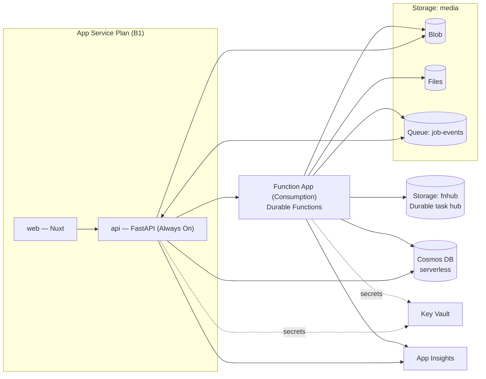

# Novel Media Studio — Deployment & Cost

Infrastructure, configuration, CI/CD, and cost for the system described in
[`architecture.md`](./architecture.md). All resources are Azure; local infrastructure assets
currently live under `deploy/`, and future Azure IaC should live with those deployment assets and
be deployed via GitHub Actions.

## Azure resource inventory

| Resource | SKU / mode | Hosts / purpose |
|---|---|---|
| App Service Plan | **B1** (or F1 for dev) | Shared by the two web apps below |
| App Service — `web` | Node | Nuxt SPA/SSR |
| App Service — `api` | Python, **Always On** | FastAPI (API + `job-events` consumer loop) |
| Function App | **Consumption** (Flex/Premium if needed) | Durable Functions (orchestrators + activities) |
| Cosmos DB | NoSQL, **serverless** | All application state (DB `mediastudio`) |
| Storage account — `media` | StorageV2, LRS | Blob (binaries) + Azure Files (ffmpeg scratch) + `job-events` queue |
| Storage account — `fnhub` | StorageV2, LRS | Durable Functions task hub (required, separate) |
| Key Vault | Standard | Provider API keys, JWT signing key, connection strings |
| Application Insights | — | Logs/metrics for `api` and the Function App |
| FlareSolverr | Container (local/dev now) | Browser-backed fetches for approved crawler metadata URLs |

Notes:
- **Two web apps, one plan.** An App Service *app* runs a single runtime, so Nuxt (Node) and
  FastAPI (Python) are two apps sharing one **plan** (the billed unit). The `api` app must have
  **Always On** enabled so its `job-events` background consumer keeps running.
- **The Function App needs its own storage account** for the Durable task hub — keep it separate
  from the `media` account to avoid mixing control traffic with user binaries.
- **`job-events` queue** lives in the `media` storage account (app-level control channel); the
  Durable control/work-item queues are internal to the task hub and are not managed by us.
- **FlareSolverr is currently a local development dependency** in
  `deploy/dockercompose.local.infra.yml`. Production hosting should be explicitly designed before
  enabling crawler metadata fetching outside trusted environments, because it launches browser
  instances and must stay limited to approved crawler hosts.

## Topology



## Configuration & secrets

- **Identity:** both `api` and the Function App use **managed identity** to read Key Vault and
  access Storage/Cosmos (no connection strings in app settings where avoidable).
- **Secrets in Key Vault:** provider API keys (Anthropic/OpenAI/ElevenLabs/Google/etc.), the JWT
  signing key, and any connection strings. The `aimodels` Cosmos docs store only a Key Vault
  *reference* (`secretRef`), never the raw key.
- **App settings (non-secret):** Cosmos endpoint, storage account names, `job-events` queue name,
  Durable task-hub name, the Function App's base URL + starter key (as a KV reference), and the
  allowed CORS origin (the `web` app URL).
- **FastAPI settings:** all FastAPI app settings use the `FAST_` prefix, grouped by domain where
  useful: `FAST_SECURITY_*`, `FAST_AZ_*`, `FAST_FLARESOLVERR_*`, and cache TTL settings.
- **Crawler settings:** `FAST_FLARESOLVERR_BASE_URL`, `FAST_FLARESOLVERR_MAX_TIMEOUT_MS`, and
  `FAST_CACHE_TTL_SECONDS_CRAWLER`. Local development points `FAST_FLARESOLVERR_BASE_URL` at
  `http://localhost:8191/v1`.
- **CORS:** FastAPI allows the Nuxt origin only; credentials mode as needed for the JWT.

## CI/CD (GitHub Actions)

- **Build:** Nuxt (`nuxt build`), FastAPI (package + deps), Functions app (Python worker).
- **Deploy:** `az deployment group create` for the IaC under `deploy/` (what-if on PRs), then app deploys —
  `web` and `api` via App Service deploy, `functions` via the Functions deploy action.
- **Environments:** a `dev` slot on F1 (cheap, cold-start-tolerant) and `prod` on B1.
- **Migrations:** Cosmos containers are created idempotently on `api` startup (or a one-shot
  init job) — no schema migrations, but partition keys are fixed at container creation.

## Scaling & timeout caveats

- **ffmpeg vs. Consumption timeout (~10 min/activity).** Crawl/translate/TTS/image activities fit.
  Video assembly for a long novel may not — mitigate by **assembling per chapter** and
  concatenating incrementally. If that is still too long, run the Function App on **Flex
  Consumption / Premium** (longer, effectively unbounded activity duration) — the only change
  that adds a fixed monthly cost.
- **Cold starts** on Consumption are fine for background jobs; if the preview path feels slow,
  a minimum-instance setting on Flex/Premium removes it (again, a cost trade-off).
- **Cosmos RUs:** serverless + single-partition access patterns + Blob-backed large content keep
  RU spend near-zero at hobby volume; watch cross-partition queries.
- **FlareSolverr concurrency:** each cache miss can launch browser work. Keep request volume low,
  cache successful results, and enforce source allowlists in the API. Do not expose FlareSolverr
  as a general-purpose proxy.

## Local infrastructure

`deploy/dockercompose.local.infra.yml` starts the local development dependencies:

- Cosmos DB emulator: `http://localhost:8081`
- Azurite Blob/Queue/Table: `http://localhost:10000`, `10001`, `10002`
- DTS emulator: `http://localhost:8082` / `8083`
- FlareSolverr: `http://localhost:8191` and API endpoint `http://localhost:8191/v1`

Start them with:

```bash
docker compose -f deploy/dockercompose.local.infra.yml -p datntdev_media_studio_infra up -d
```

## Cost estimate

Two parts: a near-free **monthly infrastructure floor**, and **per-novel AI usage** that scales
with the premium providers chosen. (2026 rates; verify Azure figures against official pricing
before committing a budget.)

### Monthly infrastructure floor

| Component | Free tier | Cost at low volume |
|---|---|---|
| App Service Plan (Nuxt + FastAPI) | F1 free (60 CPU-min/day, no Always On/SSL) | **B1 ~$13/mo** (Always On, SSL, custom domain) |
| Durable Functions (Consumption) | 1M executions + 400K GB-s free/mo | **~$0** (Flex/Premium only if ffmpeg needs it) |
| Cosmos DB (serverless) | 1,000 RU/s + 25 GB free forever | **~$0** |
| Blob Storage (hot LRS) | 100 GB/mo egress free | **~$0.50–2** |
| Azure Files (ffmpeg scratch) | — | **~$1–3** |
| Queue + task-hub storage | — | **~$0** (pennies) |
| Key Vault + App Insights | limited free ingest | **~$0–1** |
| **Infra total** | | **~$0 (F1 dev) to ~$15–18/mo (B1 prod)** |

The `api` app needs **Always On** (its `job-events` consumer must keep running), which is why
B1 is the realistic production floor. The background engine stays ~$0 on Consumption.

### Per-novel AI usage (premium defaults)

Example: 20 chapters, full audio, ~50 illustrations, a few short video scenes. Basis: ~80K words
≈ ~150K input + ~110K output tokens; ~450K TTS chars; 50 images.

| Item | Near-free option (selectable per-project) | Premium default |
|---|---|---|
| Translation | Gemini 2.5 Flash-Lite free tier → **$0** | Claude Opus 4.8 ≈ **$3.50** (Batch −50%) / GPT-5.x mini ≈ $1 |
| Audio (TTS) | Azure Neural free 500K/mo → **$0** | ElevenLabs ≈ **$50+** / Azure Neural HD ≈ **$10** |
| ~50 illustrations | Flux schnell @ $0.003 → **$0.15** | gpt-image-1 / Imagen 4 → **$1–8** |
| Video — Phase 3 default | ffmpeg slideshow → **$0** | ffmpeg slideshow → **$0** |
| Video — Phase 5 AI (opt-in) | Veo 3.1 Lite, 5×8s → **~$2** | Veo Standard+audio / Sora 2 Pro → **$16–28** |
| **Per-novel total (excl. infra)** | **≈ $0–3** | **≈ $15–90** (driven by voice + video) |

### Bottom line

- **Free monthly cost:** the whole platform (App Service F1, Durable Functions Consumption free
  grant, Cosmos free tier, Blob + free egress, queue/task-hub storage, Key Vault) runs at
  **~$0/mo** at low volume. Recommended prod floor: **~$13–18/mo** (B1 for the two web apps),
  Functions still ~$0.
- **Premium AI is per-novel, not monthly**, dominated by **ElevenLabs voice** and (Phase 5)
  **AI video** — both opt-in and cost-visible in the UI, with cheaper tiers on the AI Models page.
  Slideshow-first keeps video at **$0** until Phase 5.

## Deployment verification

- `az deployment group what-if` on the Bicep; confirm the two web apps land on one plan, the
  Function App + `fnhub` storage provision, and the `job-events` queue exists.
- Hit `web` and `api` health endpoints over HTTPS; confirm CORS from the Nuxt origin; log in with
  the seeded admin.
- In local/dev, confirm FlareSolverr responds at `http://localhost:8191` and a
  `request.get` call can fetch an approved `novel543` metadata URL.
- Confirm `api` has **Always On** on and its `job-events` consumer logs startup in App Insights.
- End-to-end smoke: create a novel → observe `pending`→`running`→`done` on the job doc → chapters
  in Blob. Restart the Function App mid-job and confirm resume-from-checkpoint.
