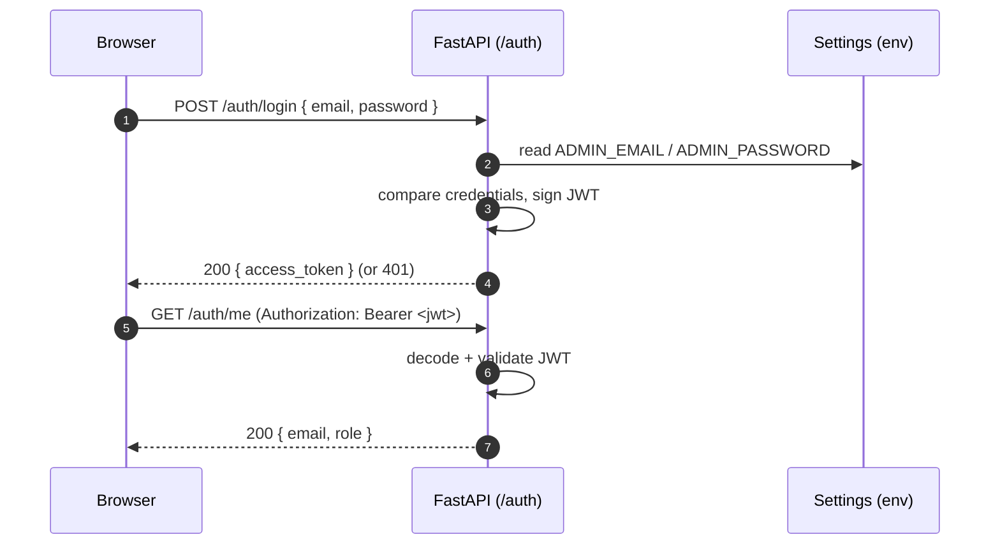
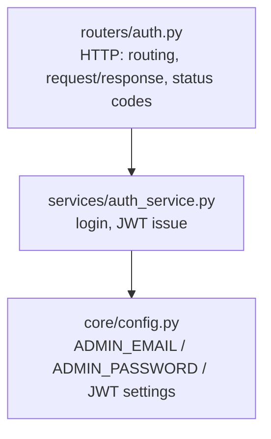

# Novel Media Studio — API (FastAPI)

The domain API for Novel Media Studio. This document scopes the **bare-minimum setup for the
authentication feature only** (FR-1) — the first slice of Phase 0. There is **no database yet**:
login is validated directly against `ADMIN_EMAIL` / `ADMIN_PASSWORD` from config. Everything
else (Cosmos, novels, projects, the `job-events` consumer, Durable orchestration) is deliberately
**out of scope here** and will be layered in later.

See the design docs for the full picture:
[`architecture.md`](../../docs/architecture.md) · [`requirements.md`](../../docs/requirements.md) ·
[`deployment.md`](../../docs/deployment.md).

## Scope (this iteration)

In scope — **auth only, no database**:

- `POST /auth/login` — verify credentials against `ADMIN_EMAIL` / `ADMIN_PASSWORD`, issue a JWT (FR-1.1).
- `GET /auth/me` — return the current user from a valid JWT (proves the token round-trips).
- `GET /health` — readiness for deployment verification.

Out of scope (added later): Cosmos DB and any persistence, user registration, novels, chapters,
projects, AI models, connectors, the `job-events` consumer, and Durable Functions integration.

## Tech stack

| Concern | Choice |
|---|---|
| Language | Python 3.12+ |
| Framework | FastAPI + Uvicorn (ASGI) |
| Validation | Pydantic v2 / `pydantic-settings` |
| Auth | JWT (`python-jose`); credentials compared against config |
| Dep management | `pyproject.toml` + pip |
| Tooling | ruff (lint+format), mypy (types), pytest (tests) |

## Login flow



## Layered architecture

Even for auth, the app keeps the target dependency direction so later features slot in cleanly:
**router → service**, with cross-cutting infra in `core/`. There is no repository layer yet
because there is no data store — the service reads the admin credentials straight from settings.



Rules: routers hold no business logic; the service reads config, not FastAPI internals. When a
database is added, a `repositories/` layer will sit between the service and the store without
changing the router or the service contract.

## Directory structure (minimal)

```
srcs/api/
  README.md                  # this file
  pyproject.toml             # package metadata + dependencies
  .env.example               # documented env vars (no secrets)
  app/
    main.py                  # FastAPI app factory; mounts routers
    core/
      config.py              #   Settings (pydantic-settings) — env-driven
      security.py            #   JWT encode/decode, password verify
      dependencies.py        #   get_current_user, get_settings
    routers/
      auth.py                #   POST /auth/login, GET /auth/me
      health.py              #   GET /health
    services/
      auth_service.py        #   validate credentials, issue JWT
    domain/
      requests.py            #   LoginRequest
      responses.py           #   TokenResponse, UserResponse
  tests/
    conftest.py
    test_auth.py
```

## Configuration

Env-driven via `core/config.py` (`pydantic-settings`). Copy `.env.example` to `.env` for local
development. Only what auth needs right now:

| Variable | Kind | Purpose |
|---|---|---|
| `ADMIN_EMAIL` | non-secret | the single accepted login email |
| `ADMIN_PASSWORD` | secret | the single accepted login password |
| `JWT_SIGNING_KEY` | secret | key used to sign/verify JWTs |
| `JWT_EXPIRE_MINUTES` | non-secret | access-token lifetime (e.g. `60`) |

> In Azure, secrets resolve from Key Vault via Managed Identity; locally they come from `.env`.

## Local development

Requires Python 3.12+.

```bash
# from srcs/api/
python -m venv .venv
source .venv/bin/activate                  # Windows: .venv\Scripts\activate

pip install -e ".[dev]"

cp .env.example .env                        # then fill in values

uvicorn app.main:app --reload --port 8000  # docs at http://localhost:8000/docs
```

## Quality gates

```bash
ruff check . && ruff format --check .
mypy app
pytest
```

## Verification

- `GET /health` returns `200`.
- `POST /auth/login` with `ADMIN_EMAIL` / `ADMIN_PASSWORD` returns a JWT; any other credentials
  return `401`.
- `GET /auth/me` with that JWT returns the admin user; a missing/invalid token returns `401`.

## Next steps (out of scope now)

Once auth is in place, Phase 0 continues with Cosmos DB (a real `users` store), the `job-events`
consumer, the Durable client, and the AI Models page — then Phase 1+ adds novels, crawling,
translation, audio, and video. See the phased roadmap in
[`architecture.md`](../../docs/architecture.md).
