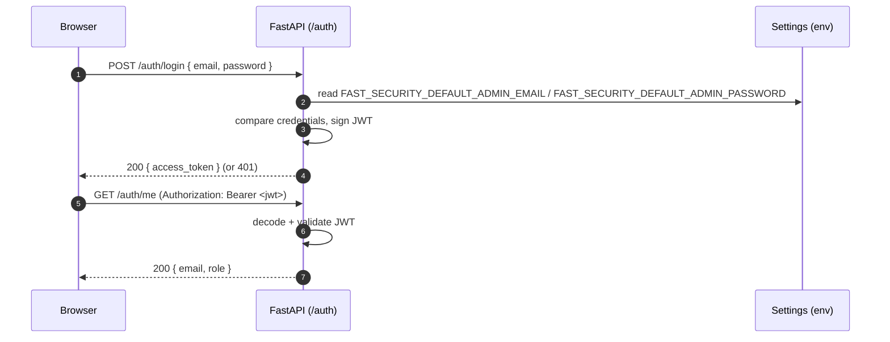
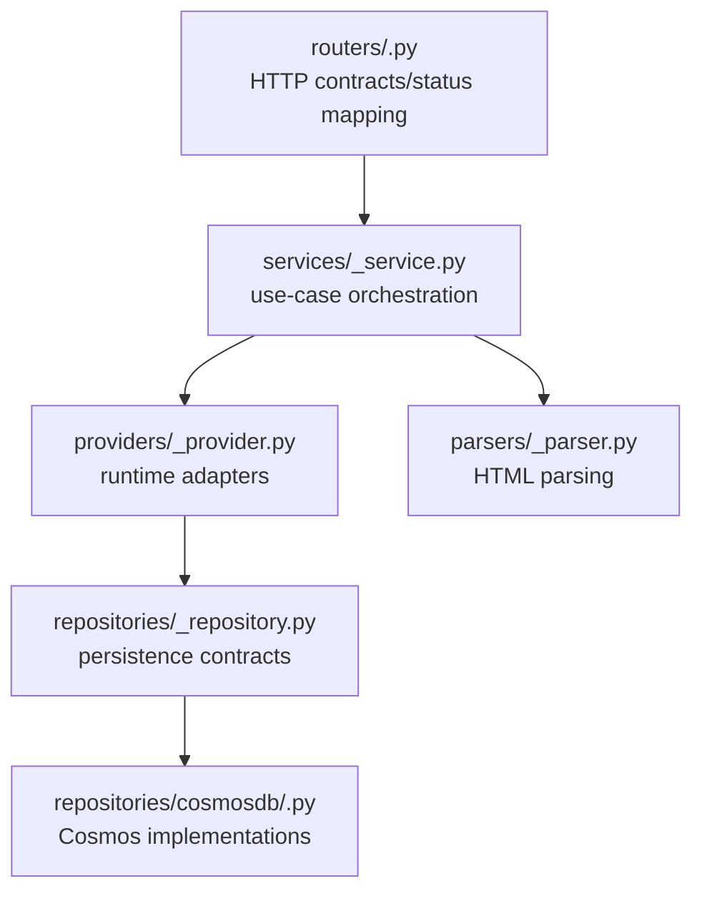

# Novel Media Studio — API (FastAPI)

The domain API for Novel Media Studio. It currently includes JWT authentication, user and novel
management, and crawler metadata/chapter content fetching for `novel543` using FlareSolverr,
Cosmos, and Azure Storage Queues.

See the design docs for the full picture:
[`architecture.md`](../../docs/architecture.md) · [`requirements.md`](../../docs/requirements.md) ·
[`deployment.md`](../../docs/deployment.md).

## Current Scope

Implemented:

- `POST /auth/login` and `GET /auth/me` for JWT sessions.
- `GET /health` readiness.
- `/api/users` admin user-management routes.
- `/api/novels` user-scoped novel-management routes.
- `/api/crawlers` registry, `/api/crawlers/{id}/metadata`, and
  `/api/crawlers/{id}/chapter` for `novel543`.
- Cosmos-backed repositories for users, novels, and jobs, plus a Cosmos-backed cache provider.
- Azure Storage Queue provider plus API-hosted APScheduler consumers for `crawler-jobs`.
- FlareSolverr-backed metadata fetching through `app/providers/proxy_service_provider.py`.
- Novel543 metadata parsing through `app/parsers/novel543_parser.py`.

Still out of scope: real chapter body crawling, translation, audio, image, and video pipelines.

## Tech stack

| Concern | Choice |
|---|---|
| Language | Python 3.12+ |
| Framework | FastAPI + Uvicorn (ASGI) |
| Validation | Pydantic v2 / `pydantic-settings` |
| Auth | JWT (`python-jose`); credentials compared against config |
| Dep management | `pyproject.toml` + pip |
| Crawler fetch | FlareSolverr through API provider |
| Background jobs | Azure Storage Queue + APScheduler inside FastAPI |
| HTML parsing | BeautifulSoup in API parser modules |
| Tooling | ruff (lint+format), mypy (types), pytest (tests) |

## Login flow



## Layered Architecture

The API keeps a simple dependency direction:

`routers → services → providers → repositories`

Cross-cutting config, security, logging, and dependency resolution live under `core/`.


Rules: routers hold no business logic; services orchestrate use cases; providers adapt runtime
capabilities such as cache and crawler registries; repositories own persistence contracts and
Cosmos implementations.

## Directory Structure

```
srcs/api/
  README.md                  # this file
  pyproject.toml             # package metadata + dependencies
  .env.example               # documented env vars (no secrets)
  app/
    main.py                  # FastAPI app factory; mounts routers
    core/
      config.py              # Settings (pydantic-settings)
      runtime.py             # Runtime composition and background consumer lifecycle
      security.py            # JWT encode/decode, password verify
      dependencies.py        # FastAPI dependency providers
    consumers/
      crawler_queue_consumer.py # crawler-jobs consumer
    domain/
      crawlers.py            # Crawler response/domain models
      requests.py            # Inbound request models
      responses.py           # Common outbound response models
    providers/
      cache_provider.py      # Generic cache behavior, TTL enforcement, and cache storage
      crawler_provider.py    # Supported crawler registry and URL validation
      proxy_service_provider.py # Proxy provider + concrete FlareSolver service
      queue_provider.py      # Azure Storage Queue provider/factory
      queue_publisher.py     # Queue publishing abstraction
      queue_subscriber.py    # Queue subscription abstraction
    parsers/
      novel543_parser.py     # Novel543 metadata parsing
    repositories/
      job_repository.py      # Async job persistence contract + in-memory repo
      cosmosdb/              # Cosmos DB implementations
    routers/
      auth.py                # POST /auth/login, GET /auth/me
      crawlers.py            # crawler registry + metadata endpoint
      health.py              # GET /health
      novels.py              # /api/novels
      users.py               # /api/users
    services/
      auth_service.py
      crawler_service.py
      novel_service.py
      user_service.py
  tests/
    conftest.py
    providers/
    repositories/
    routes/
    services/
    test_startup.py
```

## Configuration

Env-driven via `core/config.py` (`pydantic-settings`). Copy `.env.example` to `.env` for local
development.

| Variable | Kind | Purpose |
|---|---|---|
| `FAST_ENVIRONMENT` | non-secret | runtime environment name; `localhost` relaxes emulator TLS checks |
| `FAST_LOG_LEVEL` | non-secret | API log level |
| `FAST_LOG_FILE_PATH` | non-secret/local | API log file path |
| `FAST_SECURITY_JWT_SIGNING_KEY` | secret | key used to sign/verify JWTs |
| `FAST_SECURITY_JWT_EXPIRE_MINUTES` | non-secret | access-token lifetime (e.g. `120`) |
| `FAST_SECURITY_DEFAULT_ADMIN_EMAIL` | non-secret | default admin login email |
| `FAST_SECURITY_DEFAULT_ADMIN_PASSWORD` | secret | default admin login password |
| `FAST_SECURITY_CORS_ALLOWED_ORIGIN` | non-secret | allowed Nuxt web origin |
| `FAST_AZ_CONNECTION_STRING_COSMOSDB` | secret/local | Cosmos DB or emulator connection string |
| `FAST_AZ_CONNECTION_STRING_STORAGE_BLOB` | secret/local | Blob storage or Azurite connection string |
| `FAST_AZ_CONNECTION_STRING_STORAGE_QUEUE` | secret/local | Queue storage or Azurite connection string |
| `FAST_AZ_COSMOSDB_DATABASE_NAME` | non-secret | Cosmos database name |
| `FAST_FLARESOLVERR_BASE_URL` | non-secret | FlareSolverr `/v1` URL |
| `FAST_FLARESOLVERR_MAX_TIMEOUT_MS` | non-secret | Max FlareSolverr request timeout |
| `FAST_CACHE_TTL_SECONDS_CRAWLER` | non-secret | crawler cache freshness window |
> In Azure, secrets resolve from Key Vault via Managed Identity; locally they come from `.env`.

Crawler queue names, retry timing, consumer count, and simulated processing duration are defined
as application constants in `app/core/runtime.py`.

## Local development

Requires Python 3.12+, the repository root `.venv`, and local infrastructure from
`deploy/dockercompose.local.infra.yml`.

```bash
# from the repository root
scripts/backend.setup.sh
scripts/backend.start.sh
```

`backend.setup.sh` activates the root `.venv`, installs `srcs/api` with dev dependencies, and
copies `.env.example` to `.env` if needed. `backend.start.sh` activates the same environment and
runs `uvicorn app.main:app --reload --port 8000` from `srcs/api`.

## Quality gates

```bash
pytest
ruff check .
mypy app
```

## Verification

- `GET /health` returns `200`.
- `POST /auth/login` with `FAST_SECURITY_DEFAULT_ADMIN_EMAIL` /
  `FAST_SECURITY_DEFAULT_ADMIN_PASSWORD` returns a JWT; any other credentials return `401`.
- `GET /auth/me` with that JWT returns the admin user; a missing/invalid token returns `401`.
- `GET /api/crawlers/novel543/metadata?url=https://www.novel543.com/0603625457/dir` returns parsed
  metadata with the full ordered chapter list when FlareSolverr and local infrastructure are
  running.
- `GET /api/crawlers/novel543/chapter?url=https://www.novel543.com/0603625457/8096_1.html`
  returns parsed chapter content lines.

## Next Steps

The next backend slices are real chapter body crawling, AI model configuration, and the
translation/audio/image/video pipelines. See the phased roadmap in
[`architecture.md`](../../docs/architecture.md).
