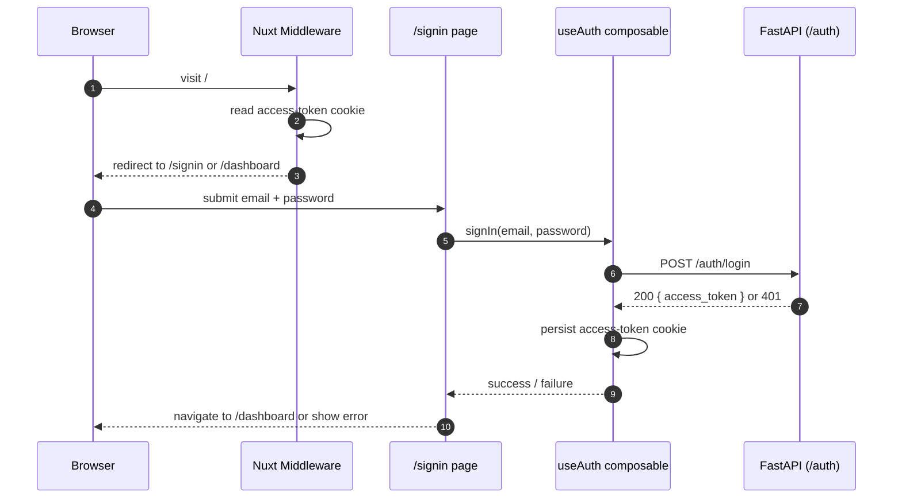
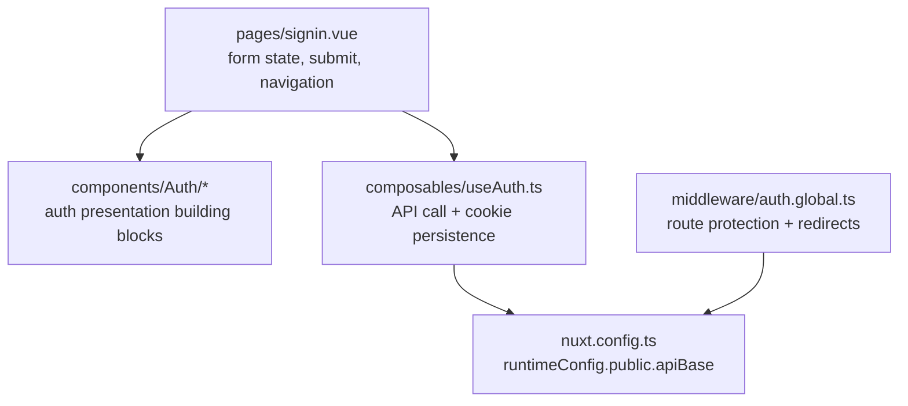

# Novel Media Studio — App (Nuxt)

The web app for Novel Media Studio. This document scopes the **bare-minimum setup for the
authentication shell only** (FR-1 / FR-7.1) — the first frontend slice of Phase 0. The app
currently provides the auth layout, sign-in screen, route protection, and a dashboard. 
It calls the API **directly** via `NUXT_PUBLIC_API_BASE`; there is **no Nitro BFF**
and no library/projects/workspace data yet.

See the design docs for the full picture:
[`architecture.md`](../../docs/architecture.md) · [`requirements.md`](../../docs/requirements.md) ·
[`deployment.md`](../../docs/deployment.md).

## Tech stack

| Concern | Choice |
|---|---|
| Language | TypeScript / Vue 3 SFCs |
| Framework | Nuxt 4 |
| UI | `@nuxt/ui` + `@nuxt/icon` |
| Styling | Tailwind CSS 4 + app-level CSS |
| Auth state | JWT stored in a Nuxt cookie (`access-token`) |
| API integration | direct browser calls to FastAPI via `NUXT_PUBLIC_API_BASE` |
| Dep management | `package.json` + pnpm |

## Login flow



## Layered architecture

The frontend keeps a simple dependency direction aligned with the longer-term app structure:
**page → composable**, with cross-route access rules in middleware and presentation split into
reusable auth components.



Rules: pages own UI state and navigation; `useAuth` owns the login request and token persistence;
middleware decides route access based on the cookie. When richer auth/user state is added later,
it should extend the composable/store layer without moving API logic into pages.

## Directory structure (minimal)

```
srcs/app/
  README.md                  # this file
  package.json               # package metadata + scripts
  pnpm-lock.yaml             # pinned dependency graph
  pnpm-workspace.yaml        # workspace marker
  nuxt.config.ts             # Nuxt config + runtime public API base
  .env.example               # documented env vars
  tsconfig.json              # TypeScript config
  public/                    # website's static assets
  app/
    app.vue                  # root app shell
    assets/
      css/
        main.css             # global styles
    layouts/
      auth.vue               # auth-page layout wrapper
    middleware/
      auth.global.ts         # redirect unauthenticated/authenticated users
    composables/
      useAuth.ts             # POST /auth/login + access-token cookie
    components/              # all components
    pages/
      index.vue              # empty entry page; middleware handles redirect
      signin.vue             # sign-in page
      signup.vue             # signup UI stub; not wired to backend yet
      dashboard.vue          # protected placeholder page
```

## Configuration

Env-driven via `runtimeConfig.public`. Copy `.env.example` to `.env` for local development.
Only what the auth shell needs right now:

| Variable | Kind | Purpose |
|---|---|---|
| `NUXT_PUBLIC_API_BASE` | non-secret | base URL for the FastAPI app (for example `http://localhost:8000`) |

> Because this value is public runtime config, it is exposed to the browser. Do not put secrets in
> `NUXT_PUBLIC_*` variables.

## Local development

Requires Node 20+ and pnpm.

```bash
# from srcs/app/
pnpm install

cp .env.example .env

pnpm dev    # app at http://localhost:3000
```

The frontend expects the API auth endpoints to be available at `NUXT_PUBLIC_API_BASE`, typically
the local FastAPI server on `http://localhost:8000`.

## Quality gates

```bash
pnpm build
```

There are currently no dedicated lint, typecheck, or test scripts defined in `package.json`.

