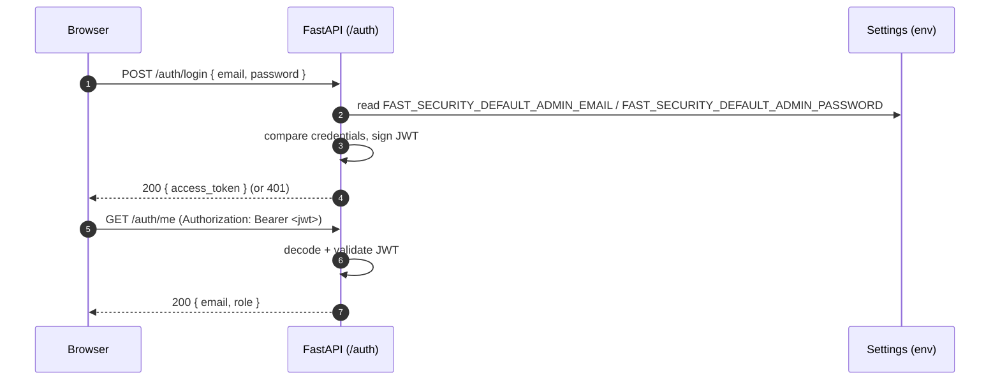
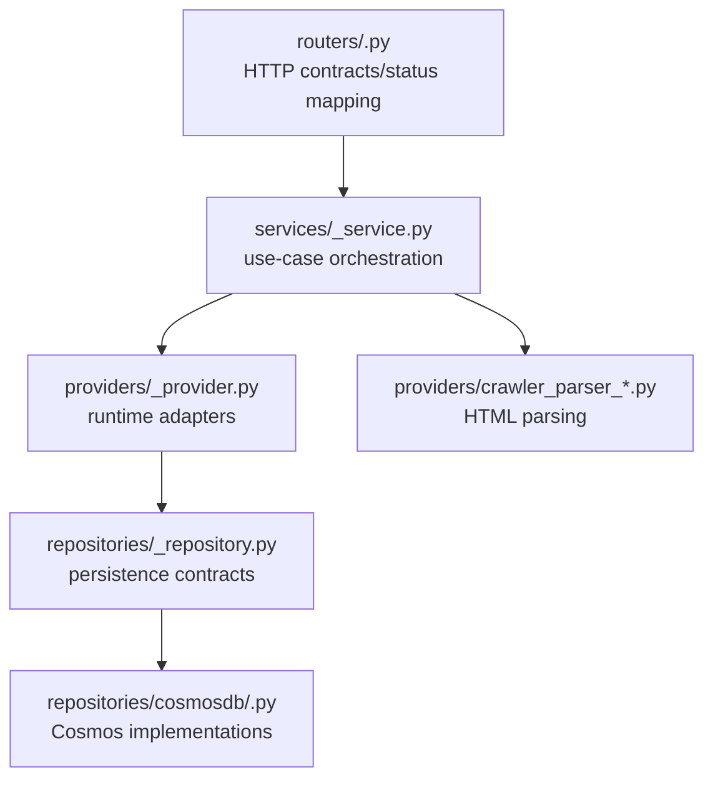

# Novel Media Studio — API (FastAPI)

The domain API for Novel Media Studio. It currently includes JWT authentication, user and novel
management, and crawler metadata/chapter content fetching for `novel543` using FlareSolverr,
Cosmos, and Azure Storage Queues.

See the design docs for the full picture:
[`architecture.md`](../../docs/architecture.md) · [`requirements.md`](../../docs/requirements.md) ·
[`deployment.md`](../../docs/deployment.md).

## Tech stack

| Concern | Choice |
|---|---|
| Language | Python 3.12+ |
| Framework | FastAPI + Uvicorn (ASGI) |
| Validation | Pydantic v2 / `pydantic-settings` |
| Auth | JWT (`python-jose`); credentials compared against config |
| Dep management | `pyproject.toml` + pip |
| Database | Azure Cosmos DB (NoSQL, serverless) |
| Storage | Azure Storage (Blob + Queue) |
| Crawler fetch | FlareSolverr through API provider |
| Background jobs | APScheduler inside FastAPI |
| HTML parsing | BeautifulSoup4 in parser modules |
| HTTP client | httpx |
| Tooling | ruff (lint+format), mypy (types), pytest (tests) |

## Quick Start

### Prerequisites

- Python 3.12+
- Virtual environment in project root (`.venv`)
- Docker running with local infrastructure (see root README)

### Setup

```bash
# From project root
./scripts/backend.setup.sh
```

This script:
1. Activates the root `.venv`
2. Installs the package with dev dependencies
3. Creates `.env` from `.env.example` if missing

### Run

```bash
# From project root
./scripts/backend.start.sh
```

Or manually:

```bash
source .venv/Scripts/activate
cd srcs/backend
uvicorn app.main:app --reload --port 8000 --env-file .env
```

API will be available at:
- API: `http://localhost:8000`
- Swagger UI: `http://localhost:8000/docs`
- ReDoc: `http://localhost:8000/redoc`

### Environment Variables

Copy `.env.example` to `.env` and configure:

- `FAST_SECURITY_*` — JWT secret and admin credentials
- `FAST_AZ_*` — Azure Cosmos DB and Storage settings
- `FAST_FLARESOLVERR_*` — FlareSolverr endpoint (defaults to `http://localhost:8191/v1`)

### Testing

```bash
cd srcs/backend
pytest
```

## Login flow



## API Architecture

The API follows a clean layered architecture with clear dependency direction:

**Dependency flow:**  
`routers → services → providers → repositories`

Cross-cutting concerns (config, security, logging, dependency injection) live under `core/`.



**Layer responsibilities:**

- **Routers**: HTTP contracts, dependency injection, status code mapping
- **Services**: Use-case orchestration and business logic
- **Providers**: Runtime capability adapters (cache, crawler registry, parsers)
- **Repositories**: Persistence contracts and implementations

## API Endpoints

### Authentication

- `POST /auth/login` — Login with email/password, returns JWT
- `GET /auth/me` — Get current user from JWT

### Health

- `GET /health` — Health check endpoint

### Crawlers

- `GET /api/scrapings/preview?crawlerId=<id>&sourceUrl=<source_url>` — Preview metadata from a source URL

### Novels

- `GET /api/novels` — List user's novels
- `POST /api/novels` — Create a new novel
- `GET /api/novels/{id}` — Get novel details
- `PATCH /api/novels/{id}` — Update novel
- `DELETE /api/novels/{id}` — Delete novel

### Users

- `GET /api/users` — List users (admin)
- `GET /api/users/{id}` — Get user details

## Development Guidelines

### Code Style

- Use `ruff` for linting and formatting
- Use `mypy` for type checking
- Follow the conventions in [`docs/conventions.api.md`](../../docs/conventions.api.md)

### Testing

Tests are organized by layer:
- `tests/routes/` — HTTP endpoint tests
- `tests/providers/` — Provider adapter tests
- `tests/repositories/` — Repository tests
- `tests/consumers/` — Background job consumer tests
- `tests/events/` — Event handler tests

### Adding New Features

1. Define domain models in `app/domain/`
2. Create repository contracts in `app/repositories/`
3. Implement Cosmos DB repositories in `app/repositories/cosmosdb/`
4. Create providers in `app/providers/` if needed
5. Implement services in `app/services/`
6. Create routers in `app/routers/`
7. Add tests for each layer

## Related Documentation

- [Architecture Overview](../../docs/architecture.md)
- [API Conventions](../../docs/conventions.api.md)
- [Requirements](../../docs/requirements.md)
- [Deployment](../../docs/deployment.md)

## Directory Structure

```
srcs/backend/
  README.md                  # this file
  pyproject.toml             # package metadata + dependencies
  .env.example               # documented env vars (no secrets)
  app/
    main.py                  # FastAPI app factory; mounts routers
    core/
      config/                # Settings and configuration
      events/                # Event definitions
      exceptions/            # Exception classes
      security/              # Security utilities
      injection.py           # Dependency injection
      logging.py             # Logging configuration
      realtime.py            # WebSocket/realtime support
    consumers/
      sample_handler.py      # Sample event handler
      scraping_handler.py    # Scraping job consumer
    domain/
      crawlers.py            # Crawler response/domain models
      novels.py              # Novel domain models
      requests.py            # Inbound request models
      responses.py           # Common outbound response models
      scraping_results.py    # Scraping result models
      scrapings.py           # Scraping domain models
      users.py               # User domain models
    events/
      sample_handler.py      # Event handler examples
      scraping_handler.py    # Scraping event handlers
    providers/
      blob_storage_provider.py    # Azure Blob Storage provider
      cache_provider.py           # Generic cache behavior, TTL enforcement
      crawler_parser_novel543.py  # Novel543 parser implementation
      crawler_provider.py         # Crawler registry and URL validation
      proxy_service_provider.py   # Proxy provider + FlareSolver service
    repositories/
      novel_chapter_repository.py      # Novel chapter persistence
      novel_repository.py              # Novel persistence
      scraping_repository.py           # Scraping job persistence
      scraping_result_repository.py   # Scraping result persistence
      user_repository.py               # User persistence
      cosmosdb/                        # Cosmos DB implementations
    routers/
      auth.py                # Authentication endpoints
      health.py              # Health check endpoint
      novels.py              # Novel CRUD endpoints
      # ... other routers
    services/
      # Service layer implementations
  shared/
    decorators.py            # Shared decorators
  tests/
    conftest.py              # Pytest fixtures
    consumers/               # Consumer tests
    events/                  # Event handler tests
    providers/               # Provider tests
    repositories/            # Repository tests
    routes/                  # Router/endpoint tests
```

## Local development

Requires Python 3.12+, the repository root `.venv`, and local infrastructure from
`deploy/dockercompose.local.infra.yml`.

```bash
# from the repository root
scripts/backend.setup.sh
scripts/backend.start.sh
```

`backend.setup.sh` activates the root `.venv`, installs `srcs/backend` with dev dependencies, and
copies `.env.example` to `.env` if needed. `backend.start.sh` activates the same environment and
runs `uvicorn app.main:app --reload --port 8000` from `srcs/backend`.

## Quality gates

```bash
pytest
ruff check .
mypy app
```
